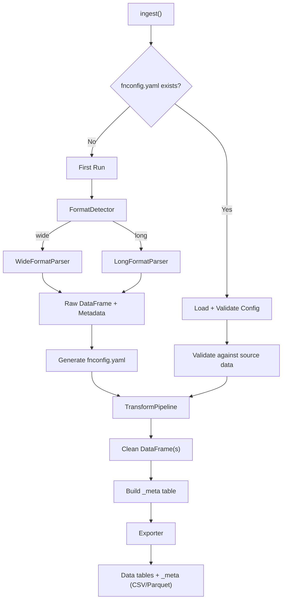

# fn-dg6-ingest -- Product Requirements Document

## Overview

**fn-dg6-ingest** is a Python library for ingesting CSV/Excel files exported from **FnGuide DataGuide 6** (released Dec 2025), auto-detecting their format, normalizing the data, and producing clean relational tables in CSV or Parquet. It follows a **config-first workflow**: on first run it generates a `fnconfig.yaml` from the data; on subsequent runs it rebuilds the output DB from that config.

---

## 1. Functional Requirements

### FR-1: File Ingestion

- Accept CSV and Excel (`.xlsx`) files exported from FnGuide DataGuide 6.
- User specifies an **input path** (file or folder) and a **destination folder** for output.

### FR-2: Auto-detect Input Shape

DataGuide 6 exports come in at least two distinct layouts. The library must detect the format automatically -- the user should not need to specify it.

- **Wide format** (pivot): Dates are spread across columns. Rows are `(코드, 아이템)` pairs. The file begins with a metadata header block (`출력주기`, `비영업일`, `주말포함`, `기간`, etc.) followed by a data grid with columns `코드, 코드명, 유형, 아이템코드, 아이템명, 집계주기, <date_1>, <date_2>, ...`.

  Example (OHLCV, sales-consensus):

  ```
  Refresh  Last Updated: 2026-02-07 15:46:56
  달력기준
  코드 포트폴리오  all  기본설정
  아이템 포트폴리오
  출력주기  일간  원화
  비영업일  제외  오름차순
  주말포함  제외
  기간  20160101  최근일자(20260206)
  코드  코드명  유형  아이템코드  아이템명  집계주기  2015-12-30  2016-01-04  ...
  A005930  삼성전자  SSC  S410000650  수정시가(원)  일간  25,200  25,200  ...
  ```

- **Long/Normal format**: Already in relational form with a proper column header row. The file has a small metadata header block followed by a single header row (e.g., `날짜, ETF코드, ETF명, 구성종목코드, 구성종목, ...`) and data rows.

  Example (ETF constituents):

  ```
  Refresh,Last Updated: 2026-02-07 16:41:37
  ETF 구성종목
  ETF,A069500,KODEX 200
  출력주기,일간,오름차순
  조회기간,20250101,최근일자(20260206)
  날짜,ETF코드,ETF명,구성종목코드,구성종목,주식수(계약수),금액,금액기준 구성비중(%)
  2025-01-02,A069500,KODEX 200,,원화현금,,9945243,0.62
  ```

### FR-3: Metadata Extraction

- Parse the header block (above the data grid) to extract dataset settings:
  - `Refresh` / `Last Updated` timestamp
  - `달력기준` or data category (e.g., `ETF 구성종목`)
  - `코드 포트폴리오`, `아이템 포트폴리오`
  - `출력주기` (output frequency)
  - `비영업일` (non-business day handling)
  - `주말포함` (weekend inclusion)
  - `기간` (date range)
  - `기본설정` (defaults: 원화, 오름차순)
- Also extract **item-level** attributes from data rows (wide format): `아이템코드`, `유형`, `집계주기`.
- This metadata feeds into both `fnconfig.yaml` (source-level settings) and the `_meta` output table (full lineage, see FR-9).

### FR-4: Table Construction and Splitting

- By default, produce a **single output table** containing all items.
- Optionally, the user can specify groupings of `아이템명` to split into **multiple output tables** via `fnconfig.yaml`. For example:
  - Group `ohlcv`: `수정시가(원)`, `수정고가(원)`, `수정저가(원)`, `수정주가(원)`
  - Group `volume`: `거래량(주)`, `거래대금(원)`
- Every output table **must include the key columns**: `코드`, `코드명`, and `date`.

### FR-5: Unit Normalization

- Detect unit suffixes in column/item names: `(원)`, `(천원)`, `(백만원)`, `(십억원)`, `(억원)`, `(%)`, `(주)`, etc.
- For monetary columns not in base unit `(원)`, apply the appropriate multiplier:

  | Suffix | Multiplier |
  |--------|-----------|
  | `(원)` | 1 (base) |
  | `(천원)` | 1,000 |
  | `(백만원)` | 1,000,000 |
  | `(억원)` | 100,000,000 |
  | `(십억원)` | 1,000,000,000 |

- After scaling, rename the column suffix to `(원)` (e.g., `총매출(천원)` -> `총매출(원)`).
- Non-monetary suffixes like `(주)`, `(%)` are left untouched.
- **Configurable**: user can opt-out of auto-normalization via `normalize_units: false` in config.

### FR-6: Data Cleaning

- **Drop empty entities**: If a `코드` (entity) has no non-null values across all dates for a given table, exclude it entirely from the output.
- **Number parsing**: Strip Korean-style thousand separators (commas) and whitespace from numeric strings.
- **Date parsing**: Normalize date columns to `datetime` / ISO-8601 format.
- **Type inference**: Numeric columns cast to appropriate numeric dtypes; preserve string columns as-is.

### FR-7: Output Formats

- Support at minimum: **CSV** and **Parquet** (via pyarrow).
- Parquet is the recommended default (preserves types, compresses well).
- Output file naming should be deterministic and descriptive (derived from table group name in config).

### FR-8: Config-First Workflow (`fnconfig.yaml`)

The library follows a **config-first** workflow:

- **First run (no config exists)**:
  1. Detect format, parse input file, extract all metadata, and discover all `아이템명` present in the data.
  2. Auto-generate a `fnconfig.yaml` in the project/output directory, pre-populated with:
     - Source file path(s) and detected format
     - Extracted metadata (`출력주기`, `비영업일`, `주말포함`, `기간`, etc.)
     - A `tables` section listing a single default table containing all discovered `아이템명`
     - Default settings: `output_format: parquet`, `normalize_units: true`, `drop_empty_entities: true`
  3. Optionally proceed to build the DB immediately, or stop after config generation (user choice via flag).

- **Subsequent runs (config exists)**:
  1. Load and validate `fnconfig.yaml` via Pydantic before any processing.
  2. Validate that referenced `아이템명` in table groups actually exist in the source data.
  3. Rebuild the entire output DB based on the config -- the config is the **single source of truth**.

- **Config modification**: Users can edit `fnconfig.yaml` directly (YAML is human-friendly) or modify it programmatically via the `IngestConfig` Pydantic model and a `save_config()` helper.

- **Config schema**: The YAML maps 1:1 to the Pydantic `IngestConfig` model, ensuring round-trip fidelity.

Example `fnconfig.yaml` (auto-generated on first run):

```yaml
# fn-dg6-ingest configuration -- auto-generated
# Edit this file to customize table groupings, output format, etc.

source:
  input_path: "inputs/dataguide_kse+kosdaq_ohlcv_from(20160101)_to(20260207).csv"
  detected_format: wide  # auto-detected; do not change unless you know what you're doing

metadata:
  출력주기: 일간
  비영업일: 제외
  주말포함: 제외
  기간: ["20160101", "20260206"]
  기본설정: ["원화", "오름차순"]
  달력기준: true

output:
  output_dir: "outputs/"
  output_format: parquet  # csv | parquet
  normalize_units: true
  drop_empty_entities: true

tables:
  # Default: single table with all items. Split into multiple by adding groups.
  default:
    - 수정시가(원)
    - 수정고가(원)
    - 수정저가(원)
    - 수정주가(원)
    - 거래량(주)
    - 거래대금(원)
  # Example: uncomment below to split into two tables
  # ohlcv:
  #   - 수정시가(원)
  #   - 수정고가(원)
  #   - 수정저가(원)
  #   - 수정주가(원)
  # volume:
  #   - 거래량(주)
  #   - 거래대금(원)
```

### FR-9: Meta Table (`_meta`)

Every pipeline run produces a flat **`_meta` table** alongside the data tables, exported in the same format (CSV/Parquet).

The meta table is **descriptive** (records what was done), complementing `fnconfig.yaml` which is **prescriptive** (records what to do). They are not duplicates -- they serve different roles:

- `fnconfig.yaml` = **user intent / pipeline configuration**
- `_meta` table = **execution record / data lineage**

One row per `(source_file, 아이템명)` combination. Schema:

| Column | Example | Description |
|--------|---------|-------------|
| `table_name` | `ohlcv` | Output table this item belongs to |
| `source_file` | `dataguide_kse+kosdaq_ohlcv_...csv` | Source filename |
| `source_hash` | `a3f2b1...` | SHA-256 of source file |
| `source_last_updated` | `2026-02-07 15:46:56` | From `Refresh` header |
| `detected_format` | `wide` | Auto-detected format |
| `아이템코드` | `S410000650` | Item code from DG6 |
| `아이템명` | `수정시가(원)` | Original item name |
| `아이템명_normalized` | `수정시가(원)` | After unit rename (if changed) |
| `유형` | `SSC` | Entity type (SSC, CON, etc.) |
| `집계주기` | `일간` | Aggregation period (일간, 2026(결산), etc.) |
| `출력주기` | `일간` | Output frequency |
| `기간_start` | `20160101` | Source date range start |
| `기간_end` | `20260206` | Source date range end |
| `unit_original` | `억원` | Original unit suffix |
| `unit_multiplier` | `100000000` | Multiplier applied (1 if no normalization) |
| `비영업일` | `제외` | Non-business day setting |
| `주말포함` | `제외` | Weekend inclusion setting |
| `entities_total` | `2400` | Total entities in source for this item |
| `entities_dropped` | `12` | Entities dropped (all-null) |
| `processed_at` | `2026-02-09T10:30:00` | Pipeline execution timestamp |

Key distinction: the meta table captures **item-level attributes** (`집계주기`, `유형`, `아이템코드`) that are discovered from data (not user-configured), plus **processing statistics** (`entities_dropped`, `source_hash`).

### FR-10: Validation

- Validate that the input file matches a known DataGuide 6 pattern (presence of `Refresh` header, known metadata keys).
- On subsequent runs, validate `fnconfig.yaml` schema and content before processing:
  - All required fields present and correctly typed.
  - All `아이템명` in `tables` groups exist in the source data.
  - `output_format` is a supported value.
- Raise clear errors with actionable messages on failure.
- First run skips config validation (config does not yet exist).

---

## 2. Non-Functional Requirements

- **NFR-1**: Pure Python library, installable via `pip` / `uv`. No database dependency.
- **NFR-2**: Configuration via Pydantic models.
- **NFR-3**: Logging via stdlib `logging` -- no print statements.
- **NFR-4**: Testable with pytest.
- **NFR-5**: Pandas + PyArrow for data manipulation.
- **NFR-6**: Dependencies managed via `uv` (never edit `pyproject.toml` directly for deps).

---

## 3. Architecture and Design

### 3.1 High-Level Data Flow



### 3.2 Key Design Patterns

- **Strategy Pattern** for `FormatDetector` / `Parser`: Each input shape has its own parser class implementing a common `Parser` protocol. The `FormatDetector` inspects the first N rows and selects the correct strategy. This is the core extensibility point -- new DataGuide formats can be added as new parser strategies.
- **Pipeline Pattern** for transforms: A sequence of composable transform steps (`NumberParser`, `UnitNormalizer`, `EmptyEntityDropper`, `TableSplitter`) applied to the raw DataFrame. Each step is a callable that takes a DataFrame and config, returns a DataFrame. Easy to reorder, add, or skip steps.
- **Config as Data** via Pydantic + YAML: All user-facing configuration lives in `fnconfig.yaml`, which maps 1:1 to a Pydantic `IngestConfig` model. On first run the config is auto-generated from discovered data; on subsequent runs it is loaded, validated, and used as the single source of truth. This is the **Config-First** pattern.

### 3.3 Package Layout

```
fn_dg6_ingest/
  __init__.py            # Public API: ingest(), init()
  config.py              # Pydantic models (IngestConfig, SourceConfig, Metadata, OutputConfig)
                         # + load_config(), save_config(), generate_default_config()
  detect.py              # FormatDetector: sniffs file, returns parser
  parsers/
    __init__.py
    base.py              # Parser protocol / ABC
    wide.py              # WideFormatParser (pivot-style OHLCV data)
    long.py              # LongFormatParser (normal-form ETF constituent data)
  transforms/
    __init__.py
    pipeline.py          # TransformPipeline orchestrator
    numbers.py           # Strip commas, parse to numeric
    units.py             # Detect unit suffix, scale, rename
    empty.py             # Drop entities with all-null data
    splitter.py          # Split into multiple tables by 아이템명 groups
  meta.py                # Build the flat _meta table from parsed metadata + processing stats
  export.py              # Exporter: write to CSV / Parquet (data tables + _meta)
  exceptions.py          # Custom exception hierarchy
tests/
  conftest.py            # Shared fixtures, path constants (INPUT_DIR, all file paths)
  unit/                  # Unit tests -- isolated, fast, no real file I/O
    test_detect.py
    test_config.py
    test_numbers.py
    test_units.py
    test_empty.py
    test_splitter.py
  integration/           # Integration tests -- end-to-end against real input files
    test_wide_ohlcv.py
    test_long_etf.py
    test_config_roundtrip.py
    test_export.py
```

### 3.4 Public API

```python
from fn_dg6_ingest import init, ingest

# --- First run: generate config from data ---
config_path = init(
    input_path="inputs/dataguide_kse+kosdaq_ohlcv_from(20160101)_to(20260207).csv",
    output_dir="outputs/",
    config_path="fnconfig.yaml",       # where to write the generated config
    run_immediately=True,              # False = only generate config, don't build DB yet
)

# --- Subsequent runs: rebuild DB from config ---
results = ingest(config_path="fnconfig.yaml")

# --- Programmatic config modification ---
from fn_dg6_ingest.config import load_config, save_config

cfg = load_config("fnconfig.yaml")
cfg.tables = {
    "ohlcv": ["수정시가(원)", "수정고가(원)", "수정저가(원)", "수정주가(원)"],
    "volume": ["거래량(주)", "거래대금(원)"],
}
save_config(cfg, "fnconfig.yaml")

results = ingest(config_path="fnconfig.yaml")
```

### 3.5 Format Detection Heuristic

1. Read the first ~20 raw lines of the file.
2. **Wide format indicators**: presence of metadata key rows (`출력주기`, `비영업일`, `주말포함`, `기간`) AND a data header row containing `코드, 코드명, 유형, 아이템코드, 아이템명` followed by date-like columns.
3. **Long format indicators**: a single header row early in the file whose columns are all descriptive names (e.g., `날짜, ETF코드, ETF명, ...`) with no date-like columns in the header.
4. Fallback: raise `UnknownFormatError` with a snippet of the first few lines for debugging.

---

## 4. Testing Strategy

**Test structure**: `tests/unit/` for isolated logic tests, `tests/integration/` for end-to-end pipeline tests against real input files.

**File path management**: All input file paths are defined as constants in `tests/conftest.py` at the top of the file for easy discovery:

```python
# tests/conftest.py
from pathlib import Path

INPUT_DIR = Path(__file__).resolve().parent.parent / "inputs"

WIDE_OHLCV_CSV = INPUT_DIR / "dataguide_kse+kosdaq_ohlcv_from(20160101)_to(20260207).csv"
WIDE_OHLCV_XLSX = INPUT_DIR / "dataguide_kse+kosdaq_ohlcv_from(20160101)_to(20260207).xlsx"
LONG_ETF_CSV = INPUT_DIR / "dataguide_etfconst(kodex200)_from(20250101)_to(20260207).csv"
LONG_ETF_XLSX = INPUT_DIR / "dataguide_etfconst(kodex200)_from(20250101)_to(20260207).xlsx"
WIDE_SALES_CSV = INPUT_DIR / "dataguide_kse+kosdaq_sales-consensus_from(20180101)_to(20260207).csv"
EVENT_STUDY_XLSX = INPUT_DIR / "dataguide_eventstudy_earningsurprise_from(20160101)_to(20260207).xlsx"
```

**Unit tests** (`tests/unit/`): Test individual components in isolation using inline strings and synthetic DataFrames. Fast, deterministic, no real file I/O.

**Integration tests** (`tests/integration/`): Full `init()` -> `ingest()` pipeline against real files from `inputs/`. Use `tmp_path` for output directories. Marked with `@pytest.mark.integration` for selective execution.

---

## 5. Implementation Phases

### Phase 1: Core (MVP)

- Config-first workflow: `init()` generates `fnconfig.yaml`, `ingest()` rebuilds from it
- Pydantic config models with YAML serialization
- Format detector (wide + long)
- Wide parser + Long parser
- Transform pipeline (number parsing, unit normalization, empty-entity drop, table splitter)
- Flat `_meta` table builder
- CSV and Parquet exporter
- Config validation on load
- Unit tests + Integration tests

### Phase 2: Polish

- CLI entry point (via `argparse` or `click`)
- Richer validation and error messages
- Additional format strategies as new DataGuide layouts are encountered
- Documentation
