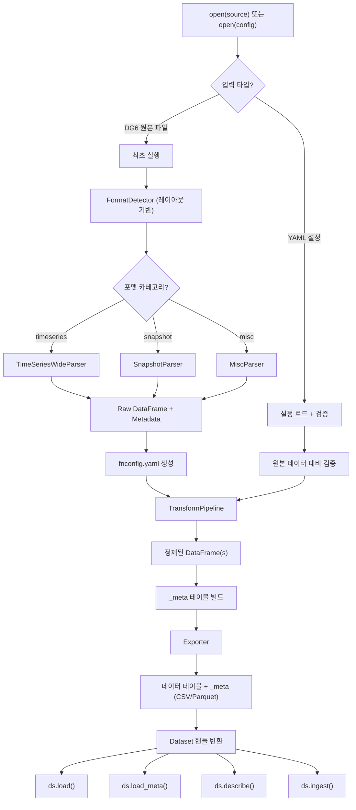

# fn-dg6-ingest -- 제품 요구사항 문서 (PRD)

## 개요

**fn-dg6-ingest**는 **FnGuide DataGuide 6** (2025년 12월 출시)에서 내보낸 CSV/Excel 파일을 자동 감지하고, 정제된 관계형 테이블(CSV/Parquet)로 변환하며, 변환된 데이터를 프로그래밍 방식으로 읽을 수 있게 해주는 Python 라이브러리이다.

핵심 설계 원칙:
- **Config-First 워크플로우**: 최초 실행 시 `fnconfig.yaml`을 자동 생성하고, 이후 실행에서는 이 설정 파일을 단일 진실 공급원(single source of truth)으로 사용한다.
- **Dataset 중심 인터페이스**: 사용자는 경로를 한 번만 지정하면 `Dataset` 핸들 객체가 이를 기억한다. 이후 모든 작업(빌드, 읽기, 조회)은 이 핸들을 통해 수행한다.

---

## 1. 기능 요구사항

### FR-1: 파일 수집 (Ingestion)

- FnGuide DataGuide 6에서 내보낸 CSV 및 Excel(`.xlsx`) 파일을 수용한다.
- 사용자는 **입력 경로**(파일 또는 폴더)와 **출력 디렉토리**를 지정한다.

### FR-2: 입력 포맷 자동 감지

DataGuide 6 내보내기는 세 가지 최상위 범주로 분류되며, DataGuide 6 인터페이스를 반영한다:

1. **시계열(Time Series)** -- 가장 흔한 범주. OHLCV, 매출 컨센서스 등. 현재 **와이드(wide)** 방향만 지원(날짜가 열, 행이 `(코드, 아이템)` 쌍). **롱(long)** 방향은 추후 추가 가능.
2. **스냅샷(Snapshot)** -- 특정 시점 데이터. 아직 미구현; 플레이스홀더 파서 존재.
3. **커스텀/기타(Misc)** -- ETF 구성종목 등 비정형 포맷. 이미 관계형(long) 형태이며 헤더 구조가 다양함.

감지는 **좌표 기반(coordinate-based)**이다: 각 알려진 포맷은 **레이아웃 YAML 파일**(`fn_dg6_ingest/layouts/*.yaml`)을 가지며, 감지 규칙과 메타데이터 추출을 위한 정확한 셀 좌표를 명시한다. 감지기는 첫 N행을 읽고 각 레이아웃의 규칙을 우선순위 순서(timeseries → snapshot → misc)로 테스트한다. 휴리스틱 스캔 없음.

- **시계열 와이드** 포맷: 날짜가 열로 펼쳐짐. 행은 `(코드, 아이템)` 쌍. 파일 시작부에 고정 좌표의 메타데이터 헤더 블록 + 데이터 그리드(`코드, 코드명, 유형, 아이템코드, 아이템명, 집계주기, <날짜1>, <날짜2>, ...`).

  예시 (OHLCV, 매출 컨센서스):

  ```
  Refresh  Last Updated: 2026-02-07 15:46:56
  달력기준
  코드 포트폴리오  all  기본설정
  아이템 포트폴리오
  출력주기  일간  원화
  비영업일  제외  오름차순
  주말포함  제외
  기간  20160101  최근일자(20260206)
  코드  코드명  유형  아이템코드  아이템명  집계주기  2015-12-30  2016-01-04  ...
  A005930  삼성전자  SSC  S410000650  수정시가(원)  일간  25,200  25,200  ...
  ```

- **기타/커스텀** 포맷: 이미 관계형 형태이며 소규모 메타데이터 헤더 포함. 데이터 유형마다 헤더 구조가 다름.

  예시 (ETF 구성종목):

  ```
  Refresh,Last Updated: 2026-02-07 16:41:37
  ETF 구성종목
  ETF,A069500,KODEX 200
  출력주기,일간,오름차순
  조회기간,20250101,최근일자(20260206)
  날짜,ETF코드,ETF명,구성종목코드,구성종목,주식수(계약수),금액,금액기준 구성비중(%)
  2025-01-02,A069500,KODEX 200,,원화현금,,9945243,0.62
  ```

### FR-3: 메타데이터 추출 (좌표 기반)

레이아웃 YAML 파일에 정의된 **셀 좌표**를 사용하여 메타데이터를 추출한다. 각 레이아웃은 `settings:` 항목에서 시맨틱 영문 키를 `(row, col)` 좌표와 선택적 파싱 모드에 매핑한다.

시맨틱 메타데이터 키(`MetadataConfig`에 저장):

| 키 | 예시 | 설명 |
|-----|---------|-------------|
| `last_updated` | `2026-02-07 15:46:56` | `Refresh` 헤더 행에서 추출 |
| `data_category` | `ETF 구성종목` | 데이터 범주 라벨 (기타 포맷) |
| `calendar_basis` | `true` | `달력기준` 행 존재 여부 |
| `code_portfolio` | `all` | 코드 포트폴리오 설정 |
| `frequency` | `일간` | 출력 주기 |
| `currency` | `원화` | 통화 설정 |
| `sort_order` | `오름차순` | 정렬 순서 |
| `non_business_days` | `제외` | 비영업일 처리 |
| `include_weekends` | `제외` | 주말 포함 여부 |
| `period_start` | `20160101` | 데이터 기간 시작 |
| `period_end` | `최근일자(20260206)` | 데이터 기간 종료 |
| `extra` | `{etf_code: A069500}` | 레이아웃 고유 필드를 위한 범용 딕셔너리 |

아이템 수준 속성도 데이터 행에서 추출(시계열): `아이템코드`, `유형`, `집계주기`.

### FR-4: 테이블 구성 및 분할

- 기본적으로 모든 아이템을 포함하는 **단일 출력 테이블**을 생성한다.
- 선택적으로, 사용자가 `fnconfig.yaml`의 `tables`에서 `아이템명` 그룹을 지정하여 **다중 출력 테이블**로 분할할 수 있다. 예:
  - 그룹 `ohlcv`: `수정시가(원)`, `수정고가(원)`, `수정저가(원)`, `수정주가(원)`
  - 그룹 `volume`: `거래량(주)`, `거래대금(원)`
- 모든 출력 테이블은 **키 컬럼**을 반드시 포함해야 한다: 시계열은 `코드`, `코드명`, `date`; 기타 포맷은 파서가 감지한 키 컬럼.

### FR-5: 단위 정규화

- 컬럼/아이템명의 단위 접미사를 감지: `(원)`, `(천원)`, `(백만원)`, `(십억원)`, `(억원)`, `(%)`, `(주)` 등.
- 기본 단위 `(원)`이 아닌 금액 컬럼에 적절한 배수를 적용:

  | 접미사 | 배수 |
  |--------|-----------|
  | `(원)` | 1 (기본) |
  | `(천원)` | 1,000 |
  | `(백만원)` | 1,000,000 |
  | `(억원)` | 100,000,000 |
  | `(십억원)` | 1,000,000,000 |

- 스케일링 후 컬럼 접미사를 `(원)`으로 변경 (예: `총매출(천원)` → `총매출(원)`).
- `(주)`, `(%)` 등 비금액 접미사는 변경하지 않음.
- **설정 가능**: 사용자가 `normalize_units: false`로 자동 정규화를 비활성화할 수 있음.

### FR-6: 데이터 정제

- **빈 종목 제거**: 특정 `코드`(종목)가 전 기간에 걸쳐 모든 날짜에서 값이 없으면 출력에서 완전히 제외.
- **숫자 파싱**: 한국식 천 단위 구분자(쉼표)와 공백을 제거.
- **날짜 파싱**: 날짜 컬럼을 `datetime` / ISO-8601 형식으로 정규화.
- **타입 추론**: 숫자 컬럼은 적절한 숫자 dtype으로 캐스팅; 문자열 컬럼은 그대로 유지.

### FR-7: 출력 포맷

- 최소한 **CSV**와 **Parquet**(PyArrow 경유)을 지원.
- Parquet이 기본값(타입 보존, 우수한 압축).
- 출력 파일명은 결정적이며 설명적(설정의 테이블 그룹명에서 파생).

### FR-8: Config-First 워크플로우 (`fnconfig.yaml`)

라이브러리는 **Config-First 워크플로우**를 따른다:

- **최초 실행(설정 없음)**:
  1. 포맷 감지, 입력 파일 파싱, 모든 메타데이터 추출, 데이터에 존재하는 모든 `아이템명` 발견.
  2. 출력 디렉토리에 `fnconfig.yaml` 자동 생성:
     - 원본 파일 경로 및 감지된 포맷명 (예: `timeseries_wide`, `misc_etf`)
     - 시맨틱 영문 키를 사용한 추출된 메타데이터
     - 발견된 모든 `아이템명`을 포함하는 단일 기본 테이블의 `tables` 섹션
     - 기본 설정: `output_format: parquet`, `normalize_units: true`, `drop_empty_entities: true`
  3. 선택적으로 즉시 DB를 빌드하거나 설정 생성 후 중단(사용자 선택).

- **이후 실행(설정 존재)**:
  1. `fnconfig.yaml`을 Pydantic으로 로드 및 검증.
  2. 테이블 그룹에 참조된 `아이템명`이 실제 원본 데이터에 존재하는지 검증.
  3. 설정에 기반하여 전체 출력 DB를 재빌드 -- 설정이 **단일 진실 공급원**.

- **설정 변경**: 사용자가 `fnconfig.yaml`을 직접 편집(YAML은 사람이 읽기 쉬움)하거나 `IngestConfig` Pydantic 모델과 `save_config()` 도우미로 프로그래밍 방식으로 수정.

- **설정 스키마**: YAML은 Pydantic `IngestConfig` 모델과 1:1 매핑, 왕복 충실도 보장.

예시 `fnconfig.yaml` (최초 실행 시 자동 생성):

```yaml
# fn-dg6-ingest configuration
source:
  input_path: inputs/dataguide_kse+kosdaq_ohlcv_from(20160101)_to(20260207).csv
  detected_format: timeseries_wide

metadata:
  frequency: 일간
  currency: 원화
  sort_order: 오름차순
  non_business_days: 제외
  include_weekends: 제외
  period_start: '20160101'
  period_end: 최근일자(20260206)
  calendar_basis: true

output:
  output_dir: outputs/kse+kosdaq_ohlcv
  output_format: parquet
  normalize_units: true
  drop_empty_entities: true

tables:
  default:
    - 수정시가(원)
    - 수정고가(원)
    - 수정저가(원)
    - 수정주가(원)
    - 거래량(주)
    - 거래대금(원)
```

### FR-9: 메타 테이블 (`_meta`)

모든 파이프라인 실행은 데이터 테이블과 함께 플랫 **`_meta` 테이블**을 동일한 포맷(CSV/Parquet)으로 출력한다.

메타 테이블은 **서술적(descriptive)**(수행된 작업을 기록)이며, `fnconfig.yaml`은 **처방적(prescriptive)**(수행할 작업을 기록)이다. 이들은 중복이 아니라 서로 다른 역할을 수행한다:

- `fnconfig.yaml` = **사용자 의도 / 파이프라인 설정**
- `_meta` 테이블 = **실행 기록 / 데이터 리니지**

`(source_file, 아이템명)` 조합당 하나의 행. 스키마:

| 컬럼 | 예시 | 설명 |
|--------|---------|-------------|
| `table_name` | `ohlcv` | 이 아이템이 속한 출력 테이블 |
| `source_file` | `dataguide_kse+kosdaq_ohlcv_...csv` | 원본 파일명 |
| `source_hash` | `523e45d8...` | 원본 파일 SHA-256 |
| `source_last_updated` | `2026-02-07 15:46:56` | `Refresh` 헤더에서 추출 |
| `detected_format` | `timeseries_wide` | 사용된 레이아웃 format_name |
| `아이템코드` | `S410000650` | DG6 아이템 코드 |
| `아이템명` | `수정시가(원)` | 원본 아이템명 |
| `아이템명_normalized` | `수정시가(원)` | 단위 변환 후 이름 |
| `유형` | `SSC` | 종목 유형 (SSC, CON 등) |
| `집계주기` | `일간` | 집계 주기 |
| `frequency` | `일간` | 출력 주기 |
| `period_start` | `20160101` | 원본 날짜 범위 시작 |
| `period_end` | `20260206` | 원본 날짜 범위 종료 |
| `unit_original` | `억원` | 원본 단위 접미사 |
| `unit_multiplier` | `100000000` | 적용된 배수 |
| `non_business_days` | `제외` | 비영업일 설정 |
| `include_weekends` | `제외` | 주말 포함 설정 |
| `entities_total` | `4071` | 원본 종목 수 |
| `entities_dropped` | `1000` | 제거된 종목 수 (전체 NaN) |
| `processed_at` | `2026-02-11T02:15:02+00:00` | 파이프라인 실행 시각 |

### FR-10: 검증

- 입력 파일이 알려진 DataGuide 6 레이아웃과 일치하는지 검증(좌표 기반 감지).
- 이후 실행에서는 처리 전 `fnconfig.yaml` 스키마와 내용을 검증:
  - 모든 필수 필드가 존재하고 올바른 타입.
  - `tables` 그룹의 모든 `아이템명`이 원본 데이터에 존재.
  - `output_format`이 지원되는 값.
- 실패 시 명확하고 실행 가능한 에러 메시지를 제공.
- 최초 실행은 설정 검증을 건너뜀(설정이 아직 존재하지 않으므로).

### FR-11: Dataset 핸들 인터페이스

라이브러리의 주요 인터페이스는 **`Dataset` 클래스**이다. 경로를 한 번만 지정하면 핸들이 이를 기억하고, 모든 후속 작업(빌드, 읽기, 조회)은 이 핸들을 통해 수행한다.

#### `open()` -- 단일 진입점

`open()`은 입력에 따라 다형적으로 동작한다:

| 인자 유형 | 동작 |
|-----------|------|
| DG6 원본 파일 경로 (CSV/Excel) | 최초 실행: 포맷 감지, 설정 생성, 출력 빌드. `Dataset` 반환. |
| 기존 YAML 설정 파일 경로 | 이후 실행: 설정 로드, `load()`/`ingest()` 준비. `Dataset` 반환. |

```python
import fn_dg6_ingest

# 최초 실행: 원본 파일에서 Dataset 생성
ds = fn_dg6_ingest.open(
    "inputs/dataguide_kse+kosdaq_ohlcv_from(20160101)_to(20260207).csv",
    output_dir="outputs/kse+kosdaq_ohlcv",
)

# 이후 실행: 기존 설정에서 Dataset 열기
ds = fn_dg6_ingest.open("outputs/kse+kosdaq_ohlcv.yaml")
```

#### `Dataset` 객체

```python
class Dataset:
    config: IngestConfig        # 파싱된 설정 (항상 사용 가능)
    config_path: Path           # YAML 위치
    output_dir: Path            # 데이터 출력 위치

    # 쓰기 측
    def ingest(self) -> list[str]

    # 읽기 측
    def load(self, table=None, codes=None,
             date_from=None, date_to=None,
             items=None) -> DataFrame | dict[str, DataFrame]
    def load_meta(self) -> DataFrame
    def describe(self) -> DatasetInfo
```

#### `Dataset.load()` -- 필터링을 지원하는 데이터 읽기

Parquet의 **열 선택(column pruning)**과 **술어 푸시다운(predicate pushdown)**을 활용하여 대용량 데이터셋에서도 필요한 부분만 효율적으로 읽는다.

```python
# 전체 데이터 로드
df = ds.load()

# 특정 테이블만 로드
df = ds.load(table="ohlcv")

# 종목 코드로 필터링 (삼성전자만)
df = ds.load(codes=["A005930"])

# 날짜 범위로 필터링
df = ds.load(date_from="2024-01-01", date_to="2025-12-31")

# 아이템(컬럼) 선택
df = ds.load(items=["수정주가(원)", "거래량(주)"])

# 조합
df = ds.load(codes=["A005930", "A000660"], date_from="2024-01-01", items=["수정주가(원)"])
```

CSV 출력의 경우 필터링은 로드 후 pandas에서 수행된다(Parquet만큼 빠르지는 않지만 동일한 인터페이스 제공).

#### `Dataset.load_meta()` -- 리니지 테이블 읽기

```python
meta = ds.load_meta()
```

#### `Dataset.describe()` -- 빠른 메타데이터 조회

Parquet 파일 푸터에서 스키마와 행 수를 읽어 데이터를 스캔하지 않고도 빠르게 정보를 제공한다. `_meta` 테이블이 있으면 더 풍부한 정보(단위 이력, 종목 통계 등)를 포함한다.

```python
info = ds.describe()
info.tables         # ["default"] 또는 ["ohlcv", "volume"]
info.items          # ["수정시가(원)", "수정고가(원)", ...]
info.shape          # {"default": (7613009, 9)}
info.date_range     # ("2015-12-30", "2026-02-06")
info.entities       # 3071
info.format_name    # "timeseries_wide"
```

`DatasetInfo`는 Pydantic 모델 또는 dataclass로 구현하여 구조화된 접근을 보장한다.

#### 기존 함수형 API와의 관계

`init()`과 `ingest()`는 **Dataset을 반환하는 팩토리 함수**로 유지된다. 함수형 스타일을 선호하는 사용자를 위한 호환성:

```python
# 함수형 스타일 (Dataset 반환)
ds = fn_dg6_ingest.init(input_path=..., output_dir=...)
ds = fn_dg6_ingest.ingest(config_path=...)

# 객체 스타일 (권장)
ds = fn_dg6_ingest.open(...)
ds.ingest()
df = ds.load()
```

### FR-12: 명시적으로 제외하는 기능

다음 기능은 라이브러리 범위를 벗어나며 의도적으로 제외한다:

| 기능 | 제외 사유 |
|------|----------|
| 쿼리 엔진 | DuckDB/Polars 영역 |
| 캐싱/메모이제이션 | 조기 최적화; 사용자가 자체 코드에서 캐싱 가능 |
| 데이터베이스 인터페이스 | NFR-1에서 DB 의존성 없음 명시 |
| 다중 데이터셋 조인 | 범위 밖; 사용자가 DataFrame을 직접 조인 |
| 지연 평가/스트리밍 | 복잡도 증가; Parquet 열 선택으로 대부분 커버 |

---

## 2. 비기능 요구사항

- **NFR-1**: 순수 Python 라이브러리, `pip` / `uv`로 설치 가능. DB 의존성 없음.
- **NFR-2**: Pydantic 모델을 통한 설정.
- **NFR-3**: stdlib `logging`을 통한 로깅 -- print문 사용 금지.
- **NFR-4**: pytest로 테스트 가능.
- **NFR-5**: Pandas + PyArrow로 데이터 처리.
- **NFR-6**: `uv`로 의존성 관리 (`pyproject.toml`에 직접 deps 편집 금지).

---

## 3. 아키텍처 및 설계

### 3.1 고수준 데이터 흐름



### 3.2 핵심 설계 패턴

- **Strategy 패턴** -- `FormatDetector` / `Parser`: 각 포맷 카테고리는 `BaseParser` 프로토콜을 구현하는 자체 파서 클래스를 가짐. 새 포맷은 레이아웃 YAML + 파서 클래스를 추가하여 확장.
- **Pipeline 패턴** -- 변환: 조합 가능한 변환 단계의 시퀀스(`NumberParser`, `UnitNormalizer`, `EmptyEntityDropper`, `TableSplitter`)를 raw DataFrame에 적용.
- **Config as Data** -- Pydantic + YAML: 모든 사용자 대면 설정은 `fnconfig.yaml`에 존재하며, Pydantic `IngestConfig` 모델과 1:1 매핑.
- **Layout as Data** -- 포맷 구조 지식(메타데이터용 셀 좌표, 감지 규칙)은 YAML 파일에 존재하며, Python에 하드코딩되지 않음.
- **Handle 패턴** -- `Dataset`: 경로 상태를 캡슐화하여 사용자가 경로를 반복 지정하지 않아도 됨. 쓰기(ingest)와 읽기(load)를 단일 객체에 통합.

### 3.3 레이아웃 시스템

각 알려진 DataGuide 6 포맷은 `fn_dg6_ingest/layouts/`에 레이아웃 YAML 파일을 가진다:

```yaml
# fn_dg6_ingest/layouts/timeseries_wide.yaml
format_name: timeseries_wide
format_category: timeseries
format_orientation: wide
description: "Time series wide format -- dates as columns"

detection:
  check_cell:
    - { row: 0, col: 0, value: "Refresh" }
  check_data_header_cols: ["코드", "코드명", "유형", "아이템코드", "아이템명", "집계주기"]
  data_header_row: 8

settings:
  last_updated:      { row: 0, col: 1, parse: "strip_prefix:Last Updated:" }
  calendar_basis:    { row: 1, col: 0, parse: "presence" }
  frequency:         { row: 4, col: 1 }
  currency:          { row: 4, col: 2 }
  # ...
```

`layout_registry.py` 모듈이 런타임에 이를 로드:
- `Layout` Pydantic 모델 -- 구조화된 접근
- `load_all_layouts()` -- 감지 우선순위별 정렬된 레이아웃 반환
- `extract_settings()` -- 레이아웃 좌표 맵으로 셀 값 읽기

### 3.4 패키지 레이아웃

```
fn_dg6_ingest/
  __init__.py            # 공개 API: open(), init(), ingest(), Dataset
  dataset.py             # Dataset 클래스 (핸들 객체, load/describe/ingest)
  reader.py              # 데이터 읽기 로직 (Parquet 필터링, CSV 폴백)
  config.py              # Pydantic 모델 (IngestConfig, SourceConfig, MetadataConfig, OutputConfig)
                         # + load_config(), save_config(), generate_default_config()
  detect.py              # FormatDetector: 좌표 기반 레이아웃 감지
  layout_registry.py     # Layout Pydantic 모델 + YAML 로더 + extract_settings()
  layouts/
    __init__.py           # 패키지 마커
    timeseries_wide.yaml  # 시계열 와이드 포맷 레이아웃
    misc_etf.yaml         # 기타 ETF 구성종목 포맷 레이아웃
  parsers/
    __init__.py
    base.py              # BaseParser ABC, ParseResult, ItemInfo
    timeseries.py        # TimeSeriesWideParser (피벗 방식 시계열 데이터)
    snapshot.py          # SnapshotParser (플레이스홀더)
    misc.py              # MiscParser (ETF 구성종목 등 커스텀 포맷)
  transforms/
    __init__.py
    pipeline.py          # TransformPipeline 오케스트레이터
    numbers.py           # 쉼표 제거, 숫자 파싱
    units.py             # 단위 접미사 감지, 스케일링, 리네이밍
    empty.py             # 빈 종목 제거
    splitter.py          # 아이템명 그룹별 테이블 분할
  meta.py                # 플랫 _meta 테이블 빌더
  export.py              # Exporter: CSV / Parquet 쓰기
  exceptions.py          # 커스텀 예외 계층
tests/
  conftest.py            # 공유 픽스처, 경로 상수
  unit/
    test_detect.py
    test_config.py
    test_numbers.py
    test_units.py
    test_empty.py
    test_splitter.py
    test_pipeline.py
    test_meta.py
    test_export.py
    test_dataset.py      # Dataset 클래스 단위 테스트
    test_reader.py       # reader 단위 테스트
  integration/
    test_timeseries.py
    test_misc_etf.py
    test_config_roundtrip.py
    test_export.py
    test_dataset_e2e.py  # Dataset 통합 테스트
```

### 3.5 공개 API

```python
import fn_dg6_ingest

# ── 최초 실행: 원본 파일에서 Dataset 생성 ──
ds = fn_dg6_ingest.open(
    "inputs/dataguide_kse+kosdaq_ohlcv_from(20160101)_to(20260207).csv",
    output_dir="outputs/kse+kosdaq_ohlcv",
)

# ── 이후 실행: 기존 설정에서 열기 ──
ds = fn_dg6_ingest.open("outputs/kse+kosdaq_ohlcv.yaml")

# ── 데이터 읽기 ──
df = ds.load()                                              # 전체
df = ds.load(codes=["A005930"], items=["수정주가(원)"])       # 삼성전자 종가만
meta = ds.load_meta()                                       # 리니지 테이블
info = ds.describe()                                        # 빠른 조회

# ── 설정 변경 후 재빌드 ──
ds.config.tables = {
    "ohlcv": ["수정시가(원)", "수정고가(원)", "수정저가(원)", "수정주가(원)"],
    "volume": ["거래량(주)", "거래대금(원)"],
}
ds.ingest()                                                 # 재빌드
df = ds.load(table="ohlcv")                                 # 분할된 테이블 로드

# ── 함수형 스타일 (호환성) ──
ds = fn_dg6_ingest.init(input_path=..., output_dir=...)
ds = fn_dg6_ingest.ingest(config_path=...)
```

### 3.6 포맷 감지 알고리즘

1. `fn_dg6_ingest/layouts/`에서 모든 레이아웃 YAML 파일을 로드.
2. 입력 파일의 첫 N행을 읽음 (N = 모든 레이아웃의 최대 `data_header_row` + 2).
3. 각 레이아웃에 대해 (카테고리 우선순위 순서: timeseries → snapshot → misc):
   - 모든 `check_cell` 규칙 테스트(지정된 좌표의 정확한 셀 값 일치).
   - `check_data_header_cols`가 설정되어 있으면 데이터 헤더 행에 필수 컬럼이 모두 포함되는지 확인.
   - 시계열 와이드의 경우 데이터 헤더의 후행 셀이 날짜처럼 보이는지 추가 확인.
   - 모든 검사를 통과하면 `(parser_class, layout)` 반환.
4. 폴백: 진단 스니펫과 함께 `UnknownFormatError` 발생.

---

## 4. 테스트 전략

**테스트 구조**: `tests/unit/` -- 격리된 로직 테스트, `tests/integration/` -- 실제 입력 파일에 대한 엔드투엔드 파이프라인 테스트.

**파일 경로 관리**: 모든 입력 파일 경로는 `tests/conftest.py` 상단에 상수로 정의:

```python
# tests/conftest.py
from pathlib import Path

INPUT_DIR = Path(__file__).resolve().parent.parent / "inputs"

WIDE_OHLCV_CSV = INPUT_DIR / "dataguide_kse+kosdaq_ohlcv_from(20160101)_to(20260207).csv"
WIDE_OHLCV_XLSX = INPUT_DIR / "dataguide_kse+kosdaq_ohlcv_from(20160101)_to(20260207).xlsx"
LONG_ETF_CSV = INPUT_DIR / "dataguide_etfconst(kodex200)_from(20250101)_to(20260207).csv"
LONG_ETF_XLSX = INPUT_DIR / "dataguide_etfconst(kodex200)_from(20250101)_to(20260207).xlsx"
WIDE_SALES_CSV = INPUT_DIR / "dataguide_kse+kosdaq_sales-consensus_from(20180101)_to(20260207).csv"
EVENT_STUDY_XLSX = INPUT_DIR / "dataguide_eventstudy_earningsurprise_from(20160101)_to(20260207).xlsx"
```

**단위 테스트** (`tests/unit/`): 인라인 문자열과 합성 DataFrame을 사용한 격리 테스트. 빠르고 결정적이며 실제 파일 I/O 없음.

**통합 테스트** (`tests/integration/`): `inputs/`의 실제 파일에 대한 전체 `open()` → `load()` 파이프라인. `tmp_path`를 출력 디렉토리로 사용. `@pytest.mark.integration`으로 선택적 실행.

---

## 5. 구현 단계

### Phase 1: 핵심 (MVP) -- 완료

- Config-First 워크플로우: `init()`이 `fnconfig.yaml` 생성, `ingest()`가 재빌드
- Pydantic 설정 모델 + YAML 직렬화
- 레이아웃 기반 포맷 감지 (좌표 YAML 파일)
- TimeSeriesWideParser + MiscParser (SnapshotParser 플레이스홀더)
- 변환 파이프라인 (숫자 파싱, 단위 정규화, 빈 종목 제거, 테이블 분할)
- 플랫 `_meta` 테이블 빌더
- CSV 및 Parquet Exporter
- 설정 검증
- 단위 테스트 + 통합 테스트 (168개 통과)

### Phase 2: Dataset 인터페이스 -- 현재

- `Dataset` 클래스 (핸들 객체)
- `open()` 단일 진입점 (원본 파일 또는 YAML 설정 경로)
- `Dataset.load()` (필터링: codes, date_from, date_to, items)
- `Dataset.load_meta()` (리니지 테이블 읽기)
- `Dataset.describe()` / `DatasetInfo` (빠른 메타데이터 조회)
- `reader.py` 모듈 (Parquet 네이티브 필터링, CSV 폴백)
- `init()` / `ingest()` 반환 타입을 `Dataset`으로 변경
- 단위 테스트 + 통합 테스트

### Phase 3: 확장

- 시계열 **long** 파서 (수직 방향 시계열 데이터)
- **Snapshot** 파서 (샘플 데이터 확보 시)
- CLI 진입점 (`argparse` 또는 `click`)
- 추가 `layouts/*.yaml` -- 새로 발견되는 포맷용
- 문서화
